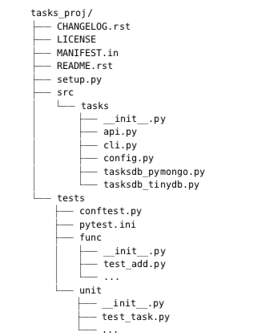

# pytest_book

Testing practice and methods presented in the book, "Python Testing with Pytest" by Okken

---
## *Pytest session info*

When running tests using Pytest, the output will be a block of information followed by the tests and the test results.

```bash
bwilkins$ python -m pytest [options]
=== test session starts ===

platform darwin -- Python 3.7.2, pytest-4.3.1, py-1.8.0, pluggy-0.9.0
rootdir: /Users/bwilkins/Projects/personal_projects/pytest_book, inifile:
collected 0 items

=== no tests ran in 0.01 seconds ===
```

* **Platform info:** The first line under the session delimiter shows platform information about the machine the tests are running on; This information differs depending on the operating system (ie. Windows vs OS X).
It also lists packages that Pytest itself is dependent on, and their versions( Py and Pluggy), as well as the version of Python.
* **Rootdir:** This line shows the *topmost common directory* to all directories being searched for tests. The **inifile**, though blank here, lists the file being used for configuration. Config files can be `pytest.ini`, `tox.ini`, or `setup.cfg`.
* **Collected items:** Though we had no tests written at the time of this writing, *collected X items* will tell you how mnay tests were found within your *Rootdir* structure.
* **Tests:** Each test file will have output showing passing or failing tests. This can be seen in more detail with --verbose arg.
  * **PASSED ( . )**: The test ran successfully
  * **FAILED ( F )**: The test did not run successfully (or XPASS + strict)
  * **SKIPPED ( s )**: The test was skipped; You can tell Pytest to skip tests using `@pytest.mark.skip()` or `pytest.mark.skipif()` decorators.
  * **XFAIL ( x )**: The test was not supposed to pass, ran, and failed. You can tell Pytest that a test is expected to fail using the `@pytest.mark.xfail()` decorator.
  * **XPASS ( X )**: The test was not supposed to pass, ran, and passed.
  * **ERROR ( E )**: An exception happened outside of the test function, in either a *fixture*, or in a *hook function*.

* **Summary:** The final line will show how many tests were run, and how long the entire process took to finish.

## *Pytest Option Args* 

**--collect-only** : This arg shows which tests will be run with the currect options and configuration settings

**-k EXPRESSION** : the -k option lets you use an expression to find which test functions to run; It can be used as a shortcut to running an individual test if its name is unique, or for running a set of tests that have a common prefix or suffix in their names.

**-m MARKEXPR** : Markers are one of the best ways to mark a subset of your tests functions so hat they can be run together. Markers are set using decorators, and any tests can be given any markers.
```bash
pytest -v -m run_these_please
```
```python
import pytest

...
@pytest.mark.run_these_please
def test_member_access():
...
```

**-x, --exitfirst** : normal behavior is for Pytest tor un every test it finds. If a test function encounters a failing `assert` or an exception, the execution for that test stops and fails, then pytest runs the next test. When debugging a problem, stopping the test session when you encounter a failing test (the `-x` option) may be the preferred workflow.

**-s and --capture=method** : The `-s` flag allows for `print()` statements to actually be printed to stdout while tests are running; It is a shortcut for `--capture=no`. Normally output is captured on all tests. Failing tests will have the output reported after the test runs, on the assumption that the output will help you understand what went wrong. These args turn off output capture, allowing `print()` statements through all test outputs.

**-v, --verbose** : Reports more information than without this arg. Should be used regularly in order to get the most information back with each test, as well as more readable results (`PASSED` or `FAILED` and the test name instead of `..F.` appended after the filename)

**-q, --quiet** : Opposite of verbose; Less information shown for each test run. Useful to use with `--tb=line`, which will report JUST the failing line of any failing tests.

**-l, --showlocals** : local variables and their values are displayed with tracebacks for failing tests. Useful to determine if a variable is incorrect, therefore causing a test failure.

**--tb=style** : modifies the way tracebacks for failures are output. Sometime tracebacks can be annoying, or not show needed info. Useful styles: `short`, `line`, and `no`.

| style option  | effect       |
| ------------- |-------------:|
| `short`      | prints just the assert line and the E evaluated line with no context |
| `line`      | keeps the failure to one line.      |
| `no` | removes the traceback completely.      |
| `long` | show the most exhaustive, informative traceback possible.      |
| `auto` | show the long version for the first and last tracebacks, if you have multiple failures.      |
| `native` | show the standard library trace without any extra information.      |


## *Pytest Project Setup*

* 'Tasks' project structure



#### **Notes on structure and included files**
* `Functional` and `Unit` tests are split into separate directories. This is not required or necessary, but allows for a subset of tests to be run easily. `Functional` tests should only break if we're intentionally changing the functionality of the system itself, while `Unit` tests could break during a code refactor or implementation change.
* the `__init__.py` files found under the `src/` and `tests/` directories are two different use-cases for init files:
    * the `src/tasks/__init__.py` file tells Python that the directory is a package, and is the main entry point when `import tasks` is used. It can be empty, or can contain code to import specific functions from `api.py` so that `cli.py` or our tests can access package functionality like `tasks.add()` instead of having to do `tasks.api.add()`.
    * The `tests/func/__init__.py` and `tests/unit/__init__.py` files are empty; but they allow us to have duplicate test file names under each directory (avoids filename collisions).
* The `pytest.ini` file is optional. Generally, these files contain project-wide configuration. There should only be one of these files in each project (if any). It can contain directives that would change the behavior of `pytest`, such as setting up a list of options that will always be used. 
* The `conftest.py` file is also optional; It is considered a 'local plugin' by pytest, and can contain *`hook functions`* and *`fixtures`*. Both hook functions and fixtures that are used by tests in multiple subdirectories should be contained in `conftest.py`. Unlike `pytest.ini` files, you can have multiple `conftest.py` files; for example you can have one @ `tests/conftest.py` and one for each subdirectory under `tests` (`tests/func/conftest.py` and `tests/unit/conftest.py` in this case)
* *`Hook functions`* are a way to insert code into part of the pytest execution process to alter how pytest works. 
* *`Fixtures`* are setup and teardown functions that run before and after test functions, and can be used to represent resources and data used by the tests.
* More information on *`Hook Functions`*, *`Fixtures`*, and both types of configuration files (`pytest.ini` and `conftest.py`) can be found @ [tests/README](./tests/README.md)


